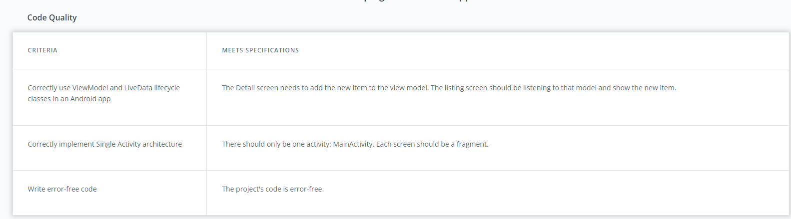

# The Shoe Store
This project consist of five screens.

1. Login screen: Email and password fields and labels plus create and login buttons
2. Welcome onboarding screen
3. Instructions onboarding screen
4. Shoe Listing screen
5. Shoe Detail screen for adding a new shoe

## Getting Started

Clone the project with command: git clone git@github.com:ctchokson/shoestore.git

### Installation

Open the project in the latest stable version of Android Studio.

## Testing

No automated tests available.

### Break Down Tests

No unit test.

## Project Instructions

This section should contain all the student deliverables for this project.
